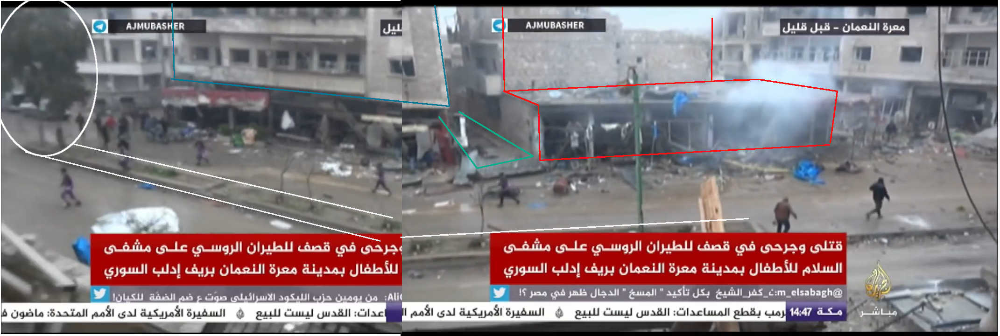
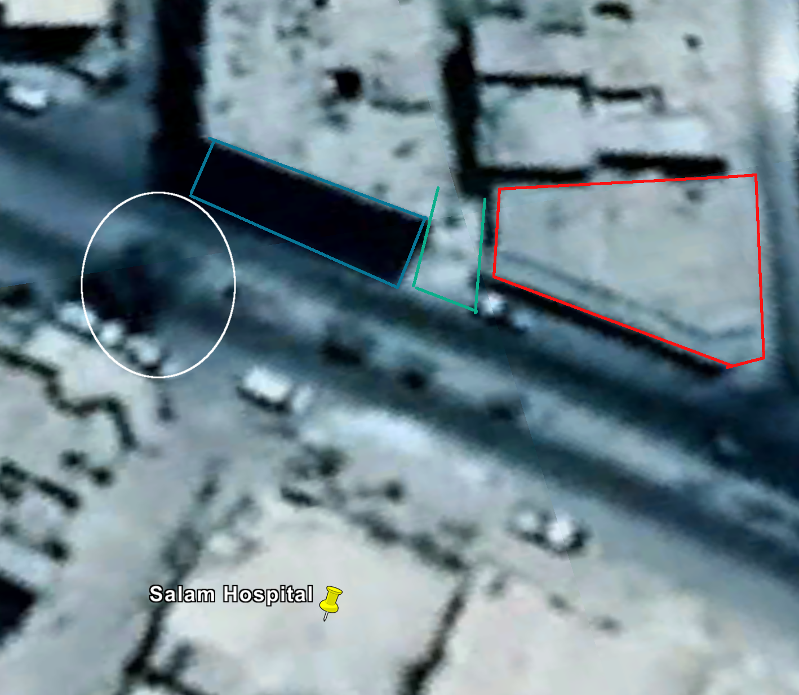

# Al-Salaam Hospital is out of service now

- Location: Maarat al-Numaan (Idlib governorate, Syria)
- Claimed targets: Al-Salaam hospital
- Date: 03 January 2018
- Attacks: 2 alleged airstrikes
- Reported killed: 5 killed
- Reported injured: 10 injured reported
- Munitions identified: Not available
- Potentially responsible: Russian or Syrian Air Force

## Background of Maarat al-Numaan

Maarat al-Numaan (also known as al-Ma'arra) is a city located 33 km south of Idlib, with a population of about 58,008 (2004 census), and so it's considered as the second largest city in Idlib. Al-Ma'arra has a long history, and its museum has mosaics from Dead Cities, which date back to 1st to 7th centuries.

[The first demonstration](https://www.youtube.com/watch?v=BZBbgO3ujm0) there took place On 25 March 2011, which called for freedom and Daraa, the city swiftly became an important hub for [organizing protests](https://www.youtube.com/watch?v=uxRnTy3-UCk). The tenth month of 2012 saw [the control of Free Syrian Army](https://www.youtube.com/watch?v=5aralZ54lXs) (FSA) on Maarat al-Numaan and since that date the city still out of the Syrian regime.

On 13 March 2016 al-Nusra Front and Jund al-Aqsa attacked the Free Syrian Army’s Division 13 in Maarat al-Numaan, overrun their depots, killing 4 of combatants and wounding as many as 20 others during the battle. Two Division's storage facilities that filled with the U.S. manufactured anti-tank TOW missiles were surrendered to the al-Nusra. Ahmad al-Sa'aoud, a Syrian rebel commander, said the attackers had seized light weapons and ammunition from his group but had not managed to capture any TOW anti-tank missiles.

Civilian opposition against al-Nusra continued for several months in al-Ma'arra, until 6 June 2016 where the clashes broke out again. On 9 June, an agreement was signed between the Free Idlib Army and Tahrir al-Sham, which requires the Division 13 to be knocked down, the Free Idlib Army will also take over all the headquarters of Division 13 except one which will be managed by Tahrir al-Sham.

### Al-Salaam Hospital

Al Salam Hospital is a maternity hospital, which founded in 1995 in Maarat al-Numan. It contains all medical departments, including women's clinics, orthopedics, general surgery, urine, etc.

Before Jan 03, the hospital treats approximately 8,000 to 9,000 patients per month. Last month, the [hospital delivered 674 babies](https://www.facebook.com/alsalam.Hospital2/photos/a.390735564429659.1073741860.182840021885882/870621066441104/?type=3), and the total number of beneficiaries from its services reached 8670 patients, including 1789 in the internal clinic, 3356 in the pediatrics clinic, 2668 in the women's clinics, and hundreds of other patients in different clinics.

Al Salaam Hospital is the only maternity hospital in Maarat al-Numan, providing emergency services, medical consultations, as well as deliveries.

### Previous Attack on Idib's Hospitals

The Syrian Archive has done in-depth two open source analysis about targeting medical facilities in Idlib governorate. The first one was entitled [Medical Facilities Under Fire](https://syrianarchive.org/en/investigations/Medical-Facilities-Under-Fire/) which addressed targeting eight hospitals and medical points including [The national hospital of Marret Numan](https://syrianarchive.org/en/investigations/Medical-Facilities-Under-Fire/Incident-1.html) whose beneficiaries was estimated about 500,000 people. The second report was under the heading [Three Idlib Medical Facilities Attacked](https://syrianarchive.org/en/investigations/Three-Idlib-Medical-Facilities-Attacked.html) and provided overviews of visual content regarding attacks targeted some of Idlib's hospital and medical points.

This report presents an in-depth analysis of the last attacks on al-Salaam hospital especially the last one which led to destroy it and becoming out of order.

### De-escalation zone

On 4 May 2017, the sponsoring states of Astana Talks (Russia, Turkey and Iran) [signed a memorandum of understanding for the establishment of de-escalation zones in Syria](https://www.youtube.com/watch?v=5cF-gIL8yzk) for at least six months, which [was extended](https://sana.sy/en/?p=116911]) at Astana 7 on 31 October 2017. The Russian Ministry of Defense [published a map showing](https://function.mil.ru/news_page/intrel/more.htm?id=12121964%40egNews) the locations included in this memorandum as shown below (de-escalation zones in blue, ISIS in grey, Syrian army in orange). See below:

These areas included Idlib province, some parts of northern Homs province, as well as some parts of adjacent provinces (Latakia, Hama, and Aleppo), Eastern Ghouta in Damascus countryside and some parts of southern Syria.

A zoomed in look at the Russian Ministry of Defense’s map (above) clearly shows that the bombed location in Maarat al-Numan city is part of the de-escalation zone established during the Astana talks.

## What Happened?

On 03 Jan 2018 between 12:15 and 13:15, al-Salaam hospital in Maarat al-Numan was attacked allegedly by Russian airforce. The hospital served approximately 500,000 people. Al-Salaam hospital was previously attacked three times since 30 Dec 2017, addressed in a [report](https://www.sams-usa.net/press_release/maternity-hospital-maarat-al-numan-city-destroyed-following-three-attacks-four-days/) published by the Syrian American Medical Society (SAMS) who supported the hospital. The report stated that the airstrikes 'killing five people, including a newborn baby girl and her father, and injuring many more'.

[SAMS puplished a vidoe](https://www.facebook.com/sams.arabic/videos/1209630115836875/) on their Facbook page showing the hospital from the insied immediately after the attack. In the evening the hospital [reported](https://www.facebook.com/sams.arabic/videos/1209757322490821/): "Al-Salaam hospital in Maarat al-N'man was becoming out of order, after violent attacks against it caused significant material damage, and its medical staff and patients were evacuated. A child was killed two hours later after she has been born in the hospital and another was injured as a result of the shelling."

[Thiqa agency published a video](https://www.youtube.com/watch?v=kKJi6vdRAmM) on their YouTube channel showing the destruction inside the hospital. See still below:

In an interview from the video, one of the medical staff stated: "Russian aircraft targeted al-Salaam hospital after the afternoon prayer, which resulted in becoming it out of order, we have ten injuries, including three children".

[Hadi Alabdallah also published a video](https://www.youtube.com/watch?v=Y6LrgHofQB4) showing the destruction in the incubators section of the hospital, see below:

Alabdallah interviewed with one of the hospital doctors who stated in the video: "I was in the operations room when two highly explosive missiles hit the hospital. We went out immediately to see the casualties. We had five victims and a number of wounded, in addition to extreme physical damage."

[RFS Media also published a video](https://rfsmediaoffice.com/2018/01/04/%D9%82%D8%AA%D9%84%D9%89-%D9%88%D8%AC%D8%B1%D8%AD%D9%89-%D8%A8%D9%82%D8%B5%D9%81-%D8%B1%D9%88%D8%B3%D9%8A-%D8%B9%D9%84%D9%89-%D9%85%D8%B3%D8%AA%D8%B4%D9%81%D9%89-%D9%81%D9%8A-%D9%85%D8%B9%D8%B1-2/) showing the destruction in the front of the hospital, see below:

The video also features an interview with a member of Syrian Civil Defence rescue team, who said: "The warplanes launched heaviest attacks on several areas in the southern countryside of Idlib. We are now in al-Salaam hospital in Maarat al-Numan, a civilian hospital, which was targeted, resulting in five victims and ten wounded".

[Maara Media Center (MMS) published a video](https://www.youtube.com/watch?v=sVU982I06rY) by Mohamed Aldaher showing the destruction outside the hospital. See stills below:

The video conducted an interview with one of Syrian Civil Defence rescue team who stated: "Russian warplanes targeted Maarat al-Numan city with two air raids targeting al-Salaam hospital and some shops in the city, killing six civilians."

## Where did it happen?

[Al Jazeera has published a video](https://www.youtube.com/watch?v=J1NBfJU5r7M) , after the attack, showing rubble removal activities around the hospital, by Syrian Civil Defense team.

The Syrian Archive team was able to geolocate several landmarks and building using the above video and Google Earth, thus confirming that the targeted location was al-Salaam hospital and its surroundings, the below stills were taken from inside and outside the hospital:

We can compare these landmarks with the image below from Google Earth:

## Flight Analysis Data (?)

## About the authors
[The Syrian Archive](https://syrianarchive.org/en/about) is a Syrian-led initiative striving to promote sustainable peace and respect for human rights within Syrian society through facilitating justice and accountability efforts. This includes evidence gathering and documentation of incidents; the acknowledgment that war crimes and human rights violations have been committed by all parties to the conflict; the identification of perpetrators to end the cycle of impunity; and the development of a process of justice and reconciliation. Through collecting, verifying, curating and investigating visual content, the Syrian Archive aims to preserve data as a digital memory to establish a database of human rights violations, and to act as a tool for legally implementing justice and accountability efforts as concept and practice in Syria.

Since its founding in 2014, the Syrian Archive have collaborated with organisations including Human Rights Watch (HRW), Amnesty International, Berkeley University and Essex University, Witness, Bellingcat and various agencies of the United Nations (UN), specifically the Independent International Commission of Inquiry on the Syrian Arab Republic.

## Errors, corrections and feedback
The authors of this report have strived for accuracy and transparency of process in reporting and presentation, while balancing the need to protect the safety of those providing documentation in some instances. With these interests in mind, detailed methodologies for some information deemed sensitive have not been published.

With that said, while all efforts have been made to present our best understanding of alleged incidents, it is recognised that the publicly available information for specific events can at times be limited.

If readers have new information about particular events; find an error in our work - or have concerns about the way we are reporting our data - please do engage with us. You can reach us at *info@syrianarchive.org*.
